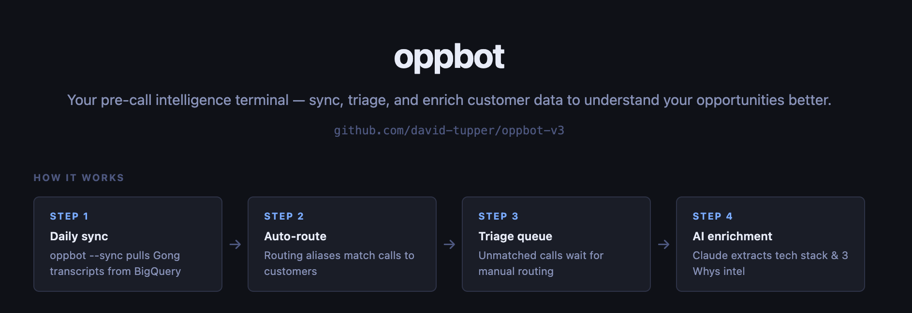

# oppbot-v3

Your pre-call intelligence terminal — sync, triage, and enrich customer data to understand your opportunities better.



---

## Requirements

- Python 3.11+
- `google-cloud-bigquery` — BigQuery client
- `flask` — triage server
- GCP credentials: `gcloud auth application-default login`
- `ANTHROPIC_API_KEY` — required for enrichment (tech stack, 3 Whys). Set in shell or add to a `.env` file in the repo root (gitignored).

---

## Setup

### 1. GCP authentication

```bash
gcloud auth application-default login
```

### 2. Add your team's Gong owner IDs

Scaffold the owners config file:

```bash
python3 gong_fetch.py --init-owners
```

This creates `gong_owners.json` in the repo root (gitignored). Edit it to add your team:

```json
{
  "Jane Smith": "1234567890123456789",
  "John Doe":   "9876543210987654321"
}
```

**Finding an owner ID:** Run this query in [BigQuery](https://console.cloud.google.com/bigquery?ws=!1m7!1m6!12m5!1m3!1ssolutions-engineering-248511!2sus-central1!3sda6760ae-64bd-49a6-b177-32e8d7bc39ac!2e1), using any call you know they hosted:

```sql
SELECT owner_id, call_title, call_started_at
FROM `grafanalabs-data-marts.mrt_core.brk_gong_calls`
WHERE DATE(call_started_at) = '2025-06-15'
  AND call_title = 'Grafana <> Acme Corp'
LIMIT 10
```

Copy the `owner_id` from the result. The dict key is a display label used in transcript filenames — it doesn't need to match anything in the system.

> **Note:** Gong calls typically appear in BigQuery with a ~2–3 day lag after they occur.

### 3. Add the local hostname (one time)

```bash
echo "127.0.0.1 oppbot.local" | sudo tee -a /etc/hosts
```

---

## Quick start

**Daily workflow — sync new calls and triage anything unmatched:**

```bash
python3 gong_fetch.py --sync    # pull last 30 days, auto-route to customer dirs
./triage.sh                      # review unmatched calls in browser
```

> **Note:** Gong calls typically appear in BigQuery with a ~2–3 day lag after they occur.

`triage.sh` opens `http://oppbot.local` and prompts for `sudo` once per boot to set up port forwarding (80 → 5555). Press Ctrl+C to stop.

---

## How it works

`gong_fetch.py` pulls call transcripts from BigQuery and routes them to customer directories. Anything it can't match goes to `_unmatched/unprocessed/` for manual triage.

```
gong_fetch.py
│
├── ① Fetch
│   ├── --account  →  fetch_calls_by_title()   (BigQuery, by title pattern)
│   └── --sync     →  fetch_calls_by_owners()  (BigQuery, by owner IDs)
│
├── ② Filter
│   ├── phone call?            → skip
│   └── already processed?     → skip  (bypass with --force)
│
├── ③ Route
│   ├── --account              → customer dir (specified by flag)
│   └── --sync → detect_customer()
│       ├── 1. routing aliases (gong_routing.json)
│       ├── 2. auto-derived title case (ventura-foods → Ventura Foods)
│       ├── 3. raw dir name word-boundary match
│       ├── matched            → customer dir
│       └── no match           → _unmatched/unprocessed/
│                                   └── triage UI (triage_server.py)
│                                       ├── route to customer dir → enrichment runs (background)
│                                       └── skip → _unmatched/processed/
│
├── ④ Write
│   ├── format_call_md()       render transcript → markdown
│   ├── write YYYY-MM-DD_title.md → customer/gong/
│   └── update manifest.json + .gong_sync.json
│
└── ⑤ Enrich  (matched customers only)
    ├── tech_stack_update.py   → appends per-call blocks to tech_stack.md
    └── three_whys_update.py
        ├── Claude call 1      extract Why Grafana / Why Now / Why Anything
        ├── append call blocks → 3_whys_summary.md
        ├── update 3_whys.json   (bullets + quotes per Why)
        ├── Claude call 2      regenerate synthesis across all calls
        └── update synthesis lines in 3_whys_summary.md
```

**Auto-routing strategies** (tried in order for `--sync`):

1. **Routing aliases** — word-boundary match against patterns in `gong_routing.json`
2. **Auto-derived pattern** — converts dir name to title case (e.g. `ventura-foods` → `Ventura Foods`)
3. **Raw dir name** — word-boundary match on the directory name itself

Calls that don't match any strategy go to `_unmatched/unprocessed/`.

---

## Directory layout

```
/Users/davidtupper/customers/
  <customer-name>/
    gong/
      manifest.json           # index of all calls for this customer
      YYYY-MM-DD_<title>.md   # transcript files
    gong_routing.json         # optional: routing aliases for this customer
    tech_stack.md             # auto-enriched from transcripts
    3_whys_summary.md         # human-readable Why Grafana / Why Now / Why Anything
    3_whys.json               # structured sidecar for downstream tools
  _unmatched/
    unprocessed/gong/         # calls with no customer match (pending triage)
    processed/gong/           # calls that were skipped in triage
```

---

## oppbot UI

```bash
./triage.sh
```

Opens `http://oppbot.local`. Three views, navigable by hotkey:

| Key | View |
|-----|------|
| `1` | Triage — route unmatched calls |
| `2` | Tech Stack — browse `tech_stack.md` per customer |
| `3` | 3 Whys — browse `3_whys_summary.md` per customer |

### Triage view

| Key | Action |
|-----|--------|
| `↑` / `↓` | Navigate up/down |
| `Enter` | Open routing overlay |
| `s` | Skip (moves to processed) |
| `u` | Switch to Unprocessed tab |
| `p` | Switch to Processed tab |
| `Esc` | Close overlay |

In the routing overlay, type to filter customer folders. If no match exists, a **+ Create folder** option appears for valid kebab-case names (`^[a-z0-9][a-z0-9-]*$`). Selecting it creates the folder and routes the call in one step.

After selecting a destination, a second prompt appears asking for an optional **routing alias** — a phrase from the call title (e.g. `Applied Research Associates`). Type a string and press Enter to save it to the customer's `gong_routing.json` so future calls auto-route. Press Enter with an empty field to skip.

The **Processed tab** shows calls that were skipped. You can re-route them to a customer folder from there if you skipped something by mistake.

The **Triage nav button** shows a count badge when there are unprocessed calls waiting.

### Tech Stack / 3 Whys views

Both views show a filterable customer list on the left and rendered markdown on the right. The file path appears above the content and is clickable — it opens the file in your default editor.

| Key | Action |
|-----|--------|
| `↑` / `↓` | Navigate customer list |
| Type in filter box | Narrow the customer list |

---

## Auto-enrichment

After each transcript is written, `gong_fetch.py` automatically runs both enrichment scripts on matched customers. The same enrichment can be triggered on demand via the `/update-tech-stack` and `/update-3-whys` Claude commands.

### Tech stack

Calls `tech_stack_update.py` to extract tech facts and append per-call blocks to `tech_stack.md` in the customer's root directory. A synthesis paragraph at the top of the file is regenerated on each new call.

**Reset and reprocess from scratch:**

```bash
rm ~/customers/<customer-name>/tech_stack.md
cd ~/customers/<customer-name>
/update-tech-stack    # scans all .md files in ./gong/ and rebuilds from scratch
```

### 3 Whys

Calls `three_whys_update.py` to extract sales qualification evidence and append it to two files in the customer's root directory:

- **`3_whys_summary.md`** — human-readable, organised into `## Why Grafana?`, `## Why Now?`, and `## Why Anything?` sections. Each call gets its own `####` block with `##### Notes` (bullet points) and `##### Quotes` (verbatim customer quotes as bullets). A synthesis line at the top of each section is regenerated on every new call to summarise cumulative signal.
- **`3_whys.json`** — structured sidecar with the same data (bullets, quotes, synthesis) in clean JSON for downstream tools.

**Reset and reprocess from scratch:**

```bash
rm ~/customers/<customer-name>/3_whys_summary.md ~/customers/<customer-name>/3_whys.json
for f in ~/customers/<customer-name>/gong/*.md; do
  python3 /path/to/three_whys_update.py --transcript "$f" --customer-dir ~/customers/<customer-name>
done
```

---

## Automatic sync

A launchd agent runs the sync daily at **12pm PT**. Run once to install:

```bash
./install-launchd.sh
```

This generates `~/Library/LaunchAgents/com.<username>.gongsync.plist` using your current username and the repo's location, then loads it immediately.

Logs: `~/Library/Logs/gongsync.log`

```bash
# Manually trigger a run
launchctl start com.$(whoami).gongsync

# Check logs
tail -f ~/Library/Logs/gongsync.log

# Stop/start the agent
launchctl unload ~/Library/LaunchAgents/com.$(whoami).gongsync.plist
launchctl load ~/Library/LaunchAgents/com.$(whoami).gongsync.plist
```

---

## CLI reference

### `--sync` — daily sync by owner

```bash
python3 gong_fetch.py --sync
python3 gong_fetch.py --sync --since 2025-01-01                        # backfill from a date
python3 gong_fetch.py --sync --since 2025-01-01 --until 2025-03-31    # specific window
python3 gong_fetch.py --sync --dry-run                                 # preview without writing
python3 gong_fetch.py --sync --force                                   # re-process already-synced calls
python3 gong_fetch.py --sync --limit 500                               # override the fetch cap (default: 1000)
```

Defaults to the last 30 days when `--since` is omitted. Warns if the result count hits `--limit`, which may indicate truncation.

> **Note:** Gong calls typically appear in BigQuery with a ~2–3 day lag after they occur.

### `--account` — manual fetch for a specific account

```bash
python3 gong_fetch.py --account "<customer-name>"
python3 gong_fetch.py --account "<customer-name>" --title-pattern "Acme,Acme Corp"
python3 gong_fetch.py --account "<customer-name>" --since 2025-01-01 --until 2025-06-30
python3 gong_fetch.py --account "<customer-name>" --dry-run
python3 gong_fetch.py --account "<customer-name>" --force
```

> **Note:** Gong calls typically appear in BigQuery with a ~2–3 day lag after they occur.

### Schema inspection

```bash
python3 gong_fetch.py --schema    # print all columns in brk_gong_calls
```

### Custom customers directory

```bash
python3 gong_fetch.py --sync --customers-dir /path/to/customers
```

### Owner config

```bash
python3 gong_fetch.py --init-owners    # scaffold gong_owners.json (edit to add your IDs)
```

### Routing config management

```bash
python3 gong_fetch.py --init-routing                        # scaffold gong_routing.json for all customer dirs
python3 gong_fetch.py --add-alias grafana-labs "Grafana"   # add a routing alias
python3 gong_fetch.py --show-routing                        # print the full routing table
```

### Reset all fetched data

```bash
python3 gong_fetch.py --nuke
```

Deletes all transcripts, manifests, enrichment files (`.md`, `.json`), and `.gong_sync.json` across all customer directories and `_unmatched/`. Customer directories and `gong_routing.json` files are preserved. Requires typing `nuke` at the confirmation prompt.
